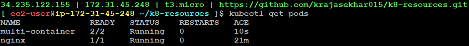

## Kubernetes Resources
- In kubernetes, everything is a resources

**1. Namespace**

- Just like VPC, you will have a dedicated isolated project to create your workloads/resources where we can create our workloads or resources.

**Example:**
```
apiVersion: v1
kind: Namespace
metadata: 
  name: expense
  labels:
    project: expense
    environment: dev
```

Command to Apply:
```
kubectl apply -f 01.namespace.yml
```
To get namespaces:
```
kubectl get namespaces
```


- Here, there will be one default namespace which is already created internally and there will be another three namespaces which are used for kubernetes internal purpose and another namespace `expense` which is created by us.

To delete namespaces:
```
kubectl delete -f 01.namespace.yml
```

**2. Pod**

- Pod is the smallest deployable unit in kubernetes. It can contain one or many containers

**Example:**
```
apiVersion: v1
kind: Pod
metadata:
  name: nginx
spec:
  containers:
  - name: nginx
    image: nginx
```

To get Pods:
```
kubectl get pods
```
To get inside the pod: (How can you login to the runnning pod)
```
kubectl exec -it nginx -- bash
```
To check nginx working or not:
```
curl localhost
```

**3. Multi-Container**

- In Kubernetes, a multi-container resource typically refers to a Pod that hosts multiple containers. A Pod is the smallest deployable unit in Kubernetes and can contain one or more containers that share the same network namespace and storage volumes.

Example:
```
kind: Pod
apiVersion: v1
metadata:
  name: multi-container
spec:
  containers:
  - name: nginx
    image: nginx
  - name: almalinux
    image: almalinux:9
    command: ["sleep","1000"]
```



Note:
- Pod-1 and Pod-2 can have same nginx container with same name. Because there pod identities get different
- Pod-2 should not have same nginx container with same name. Because conflicts may occur

> Sometime container is not able to start. At that time we will get `CrashLoopBackoff` error which is popular in kuberbetes

- If any updates in pods, we can get an error that `may not change fields other than specific containers`
- Then we have to delete the pod and recreate it

To login to specific container:
```
kubectl exec -it multi-container -c almalinux -- bash
```
If we check, it will show nginx
```
curl localhost
```
Here, nginx can access almalinux using localhost. Because, both the containers in a pod are sharing same network identity.


- Basically, nginx logs are saved in `/var/log/nginx`. We know that containers are temporary. If we delete container, then logs also will get deleted.
- We need logs for troubleshooting. So, we will save the logs in `elasticsearch`
- Here, nginx responsibility is to give response to users requests when they hit nginx. If we say nginx to store logs in elasticsearch, then nginx will get deviated from usual response. 
- So, in this case we use almalinux to store nginx logs in elastic search. This is called as sidecar 
- So, multi-container resource is used in sidecar and proxy-patterns.


