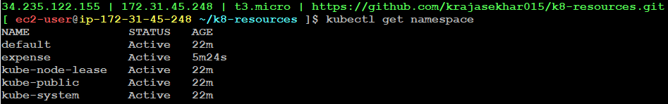

## Kubernetes Resources
- In kubernetes, everything is a resources

**1. Namespace**

- Just like VPC, you will have a dedicated isolated project to create your workloads/resources where we can create our workloads or resources.

**Example:**
```
apiVersion: v1
kind: Namespace
metadata: 
  name: expense
  labels:
    project: expense
    environment: dev
```

Command to Apply:
```
kubectl apply -f 01.namespace.yml
```
To get namespaces:
```
kubectl get namespaces
```


- Here, there will be one default namespace which is already created internally and there will be another three namespaces which are used for kubernetes internal purpose and another namespace `expense` which is created by us.

To delete namespaces:
```
kubectl delete -f 01.namespace.yml
```

**2. Pod**

- Pod is the smallest deployable unit in kubernetes. It can contain one or many containers

**Example:**
```
apiVersion: v1
kind: Pod
metadata:
  name: nginx
spec:
  containers:
  - name: nginx
    image: nginx
```

To get Pods:
```
kubectl get pods
```
To get inside the pod: (How can you login to the runnning pod)
```
kubectl exec -it nginx -- bash
```
To check nginx working or not:
```
curl localhost
```

**3. Multi-Container**

- In Kubernetes, a multi-container resource typically refers to a Pod that hosts multiple containers. A Pod is the smallest deployable unit in Kubernetes and can contain one or more containers that share the same network namespace and storage volumes.

Example:
```
kind: Pod
apiVersion: v1
metadata:
  name: multi-container
spec:
  containers:
  - name: nginx
    image: nginx
  - name: almalinux
    image: almalinux:9
    command: ["sleep","1000"]
```


Note:
- Pod-1 and Pod-2 can have same nginx container with same name. Because there pod identities get different
- Pod-2 should not have same nginx container with same name. Because conflicts may occur

> Sometime container is not able to start. At that time we will get `CrashLoopBackoff` error which is popular in kuberbetes

- If any updates in pods, we can get an error that `may not change fields other than specific containers`
- Then we have to delete the pod and recreate it

To login to specific container:
```
kubectl exec -it multi-container -c almalinux -- bash
```
If we check, it will show nginx
```
curl localhost
```
Here, nginx can access almalinux using localhost. Because, both the containers in a pod are sharing same network identity.


- Basically, nginx logs are saved in `/var/log/nginx`. We know that containers are temporary. If we delete container, then logs also will get deleted.
- We need logs for troubleshooting. So, we will save the logs in `elasticsearch`
- Here, nginx responsibility is to give response to users requests when they hit nginx. If we say nginx to store logs in elasticsearch, then nginx will get deviated from usual response. 
- So, in this case we use almalinux to store nginx logs in elastic search. This is called as sidecar 
- So, multi-container resource is used in sidecar and proxy-patterns.

**4. Labels**

- In Kubernetes, label resources are key-value pairs that are attached to objects such as pods, services, and nodes. Labels are used to organize and select subsets of objects.

- Labels add metadata to pod and it is used as selectors

Example:
```
kind: Pod
apiVersion: v1
metadata:
  name: labels
  labels:
    project: expense
    module: backend
    environment: dev
spec:
  containers:
  - name: nginx
    image: nginx
```

To get full details about pod:
```
kubectl describe pod podname
```

**5. Annotations**

- In Kubernetes, annotations are similar to labels but serve a different purpose. Annotations are key-value pairs that can be attached to Kubernetes objects, and they are primarily used to store metadata that is not intended for identification or selection purposes.
- Labels are used for kubernets internal resource selectors and Annotations are used for kubernetes external resource selectors

Example:
```
kind: Pod
apiVersion: v1
metadata:
  name: annotations
  annotations:
    imageregistry: "https://hub.docker.com/"
    buildURL: "https://jenkins.joindevops.com/expense/backend/build/67"
spec:
  containers:
  - name: nginx
    image: nginx
```

**6. Env**

- In Kubernetes, "env" resources typically refer to environment variables that can be defined for containers within a pod

Example:
```
kind: Pod
apiVersion: v1
metadata:
  name: environment
spec:
  containers:
  - name: nginx
    image: nginx
    env:
      - name: course
        value: devops
      - name: trainer
        value: "sivakumar reddy"
      - name: duration
        value: "120hr"
```

**ENV in image definition vs ENV in manifest:**
- env in Dockerfile should rebuild, if you change anything 
- env in manifest no need to rebuild, just restart is enough 
- One of the advantage to keep the env in manifest is to restart whenever it changes 
- env in kubernetes is a list of key-value pairs

To access the environment variables inside the code, login to pod
```
kubectl exec -it environment -- bash
```
```
env
```

**7. Resource Limit**

- In Kubernetes, resource limits are settings that define the maximum amount of CPU and memory that a container can use.

Resource utilization :
- **Docker advantage in resource utilization:** It will consume the resource dynamically and it will not block the resource
- In virtualization, underline host will block the resources 

Disadvantage:
- If something goes wrong in loop, it will occupy entire host resources 
- we need to allocate the resources to the container 

Requests and limits:
- If the node where a pod is running has enough of a resource available, it's possible(and allowed) for a container to use more resource than its request for that resource specifies. However, a container is not allowed to use more than its resource limit
- Here, requests is softlimit and limits is hardlimit
- When the container get starts, it will have softlimt. But it can go upto hardlimit if there are too many responses comming.

Example:
```
kind: Pod
apiVersion: v1
metadata:
  name: limits
spec:
  containers:
  - name: nginx
    image: nginx
    resources:
      requests:
        cpu: 100m
        memory: 68Mi
      limits:
        cpu: 120m
        memory: 100Mi
```

- This can be useful in monitoring as well

**8. Config Map**

- In Kubernetes, a ConfigMap is a resource that allows you to store configuration data as key-value pairs
- It will supply the configuration values for our applications

Example:
```
apiVersion: v1
kind: ConfigMap
metadata:
  name: nginx-config
data:
  course: devops
  duration: "120hrs"
```

List of commands we apply here:
```
kubectl apply -f 08-config-map.yaml 
```
```
kubectl get configmaps
```
```
kubectl describe configmap nginx-config 
```

- We will refere this config-map files as show below

**9. Pod Config**

Example:
```
kind: Pod 
apiVersion: v1 
metadata:
	name: pod-config
spec:
	containers:
	- name: nginx 
	  image: nginx
	  env:
	    - name: course 
		    valueFrom: 
			    configMapKeyRef: 
            name: nginx-config # name of the config map you are referring to 
            key: course   # env.name and config map key name can be different or same there is no difference
      - name: duration
        valueFrom:  
          configMapKeyRef: 
            name: nginx-config
            key: duration
```

List of commands we use here:
```
kubectl apply -f 09-pod-config.yaml
```
``` 
kubectl get pods 
```
```
kubectl exec -it pod-config -- bash 
```
- To make changes without touching pod definition:

```
kubectl get configmap
```

```
kubectl edit configmap nginx-config
```
- It will open VIM editor. We can changes values here and save it.

- After changing values, to get reflect in pod, we need to restart it. Here restart is nothing but we delete the pod and create it again

```
kubectl delete pod pod-config
```
```
kubectl apply -f 09-pod-config.yaml
```
```
kubectl exec -it pod-config -- bash
```
```
env
```

- It is difficult to manage the large file when env variables get increases
- So, we will use entire configmap file reference here

Example:
```
kind: Pod 
apiVersion: v1 
metadata:
	name: pod-config
spec:
	containers:
	- name: nginx 
	  image: nginx
	  envFrom:
	  - configMapRef:
		 name: nginx-config
```

- config-map files are non confidential information

**10. Secretes**

- In Kubernetes, a Secret is a resource designed to store sensitive information, such as passwords, OAuth tokens, SSH keys, or any other data that you want to keep confidential. Secrets are used to ensure that sensitive data is not hardcoded into application code or stored in plain text

Example:
```
apiVersion: v1
kind: Secret
metadata:
  name: pod-secret
type: Opaque
data:
  username: c2l2YWt1bWFyCg==
  password: YWRtaW4xMjMK
```

- Here, we have to encode the data using base64 and keep it in a file
- Encoding:
    - echo "rajasekhar" | base64 
    - echo "admin123" | base64

List of commands we use here:
```
kubectl apply -f 10-secret.yaml
```
```
kubectl get secrets
```
```
kubectl describe secret pod-secret
```

- We decode this information in pods as shown below

**11. pod secrets**

Example:
```
kind: Pod
apiVersion: v1
metadata:
  name: pod-secret
spec:
  containers:
  - name: nginx
    image: nginx
    envFrom:
    - secretRef:
        name: pod-secret
```

List of commands we use here:
```
kubectl apply -f 11-pod-secret.yaml		 
```
```
kubectl get pods
```
```
kubectl exec -it pod-secret -- bash 
```

- Decoding
   - echo "uswduiaSCJKZJK" | base64 --decode

- Encryption is different compared to encoding and decoding. We use secret manager or ssm parameters in AWS for encryption

**12. Service**

How can you access your pod in interent or outside?  <br>
A) By exposing to services 

- Service is another type of resource

- Now, we can access IP address of pod-secret in annotations. 
```
kubectl get pods
```
```
kubectl describe pod pod-secret
```
- Copy the IP address from here
- Login to annotations
```
kubectl exec -it annotations -- bash
```
```
curl IPAddress
```
- So, we can access the IPaddress of pod-secrete in annotations
- pod IP are ephemeral. It means any time it can change 
- It is not good to access the pod to pod with Ip address
- we can use `services` to communication between pods 

**Kubernetes services**

- A service is a method for exposing a network application that is running as one or more Pods in your cluster
- Pod to Pod commuincation can be achieved in kubernetes through services
- We have three services
    - **Cluster IP:**
        - It is default. Cluster IP only for internal pod to pod communication but cannot access in internet
        - Here, services defines that which pod should select using labels
        - If service wants to attach to pod, it uses labels
        - It is recommended to give as many as labels possible that creates the uniqueness
        - When service is getting created, it will search all the available pods and the service get attached to the pod where defined lables are mentioned/matched
      
      

        - Here, annotations pod wants to connect to labels pod through service. It hit request to kubernetes service and service hit request to lables pod.
        
        - Here, Service can act as DNS to pod and Load-balancer as well

        Example:
        ```
        kind: Service
        apiVersion: v1
        metadata:
          name: nginx
        spec:
          selector:
            project: expense
            module: backend
            environment: dev
          ports:
          - name: nginx-svc-port
            protocol: TCP
            port: 80        #service port
            targetPort: 80  #container port
        ```

        - List of commands we apply here:
        ```
        kubectl apply -f 12-service.yaml
        ```
        ```
        kubectl get services 
        ```
        - Now, get login to any of the pod and `curl nginx`, we will get the response
        ```
        kubectl exec -it annotations -- bash
        ```
        ```
        curl nginx
        ```
        - Now, we can restart pod n-number of times orelse delete and recreate it but we can access it through service
        - If we see the full details of nginx service, we we will get the Endpoint that is pod Ip address
        - Everytime when we create a service, it will get attched to the pod
        ```
        kubectl describe service nginx
        ```

    - **Node Port:**
        - Node port means open a port on node/underlying host
        - You can expose the port to the external world like internet
        - when you create a nodeport service, a port is opened on each workernode and it will be forwarded to the Pod

      Example:
      ```
      kind: Service
      apiVersion: v1
      metadata:
        name: nginx-np
      spec:
        type: NodePort
        selector:
          project: expense
          module: backend
          environment: dev
        ports:
        - name: nginx-svc-port
          protocol: TCP
          port: 80 # service port
          targetPort: 80 # container port
      ```

      

      - Here, one port number is open for workernode i.e 32274
      - Any user can access this host ip:port number and it takes that port number to Pod

      List of commands we use here:
      ```
      kubectl apply -f 13-node-port.yaml
      ```
      ```
      kubectl get services 
      ```
      ```
      kubectl get pods -o wide 
      ```
      - check for the labels IP address and compare with the instance and give the security group and Allow all traffic and all Ip 0.0.0.0/0
      - access with that IP address in chrome --> Ipaddress:32274
      - And also try with the other instances IP addresses 
      - So, we don't need in which node the pod is present
      
    - **Load Balancer**

    - List of commands we use:
    ```
    kubectl apply -f 14-load-balancer.yml
    ```
    ```
    kubectl get services
    ```
    - Here, loadbalancer will open nodeport portno.31857 and it also creates actual loadbalancer in the cloud

    

    - Here, user will hit loadbalancer and the request from loadbalancer goes to one workernode randomly which is healthy on nodeport portno.31857. Ultimately the request reaches the pod through cluster IP
    - EKS Nodeport ranges from 30000-32767. It will select randomly from this range. We can also specify particular Node port.

    

    - ClusterIP is the subset of NodeIP
    - Nodeport is subset of Loadbalancer

**13. Sets**

- In kubernetes, there are four type of sets: They are
    - Replica Set
    - Deployment Set
    - Daemon Set
    - Statefulset
  
**Replica Set**
- Replica Set make sure your desired number of pods running all the time
    - Suppose, if we want three pods then replica set responsibility is at any point of time there should be three pods running
- Replica set selects pods based on the labels

```
apiVersion: apps/v1
kind: ReplicaSet
metadata:
  name: nginx
  labels: # these are replicaset labels
    app: nginx
    tier: frontend
spec:
  # modify replicas according to your case
  replicas: 3
  selector:
    # these are used to select the pod to create replicas
    matchLabels:
      tier: frontend
      app: nginx
  # this is pod definition
  template:
    metadata:
      # these labels belongs to pod
      labels:
        tier: frontend
        app: nginx
    spec:
      containers:
      - name: nginx
        image: nginx:stable-perl
```

```
kubectl apply -f 15-replicaset.yml
```
```
kubectl get pods
```
```
kubectl get replicasets
```

- We cannot select pod name in replica set. If we select any name, then kubernetes will create with that name along with some random number. Example: `nginx-5t9st`
- If we delete any one of the pod, then it will create another pod automatically.

```
kubectl delete pod nginx-vpnm4
```
```
kubectl get pods
```

- Attach any service to this replicaset using same labels that are mentioned in replicaset

```
apiVersion: apps/v1
kind: ReplicaSet
metadata:
  name: nginx
  labels: # these are replicaset labels
    app: nginx
    tier: frontend
spec:
  # modify replicas according to your case
  replicas: 3
  selector:
    # these are used to select the pod to create replicas
    matchLabels:
      tier: frontend
      app: nginx
  # this is pod definition
  template:
    metadata:
      # these labels belongs to pod
      labels:
        tier: frontend
        app: nginx
    spec:
      containers:
      - name: nginx
        image: nginx:stable-perl
---
kind: Service
apiVersion: v1
metadata:
  name: nginx
spec:
  selector:
    tier: frontend
    app: nginx
  ports:
  - name: nginx-svc-port
    protocol: TCP
    port: 80 # service port
    targetPort: 80 # container port
```

```
kubectl apply -f 15-replicaset.yml
```
```
kubectl describe service nginx
```
- Here, we can see there are three endpoints which are three replicasets. Here, service will loadbalance these three IP addresses

- Suppose, if we change the version of image in replicaset and apply the changes. It won't get reflected.
- Replicaset can't update the image version. Its only responsibilities is to maintain desired number of replicas
- If we change image version in pod, let it be in 02-pod.yml, then its get updated with new version of image.
- We can overcome this with deployment set
- Delete the replicaset 
```
kubectl delete -f 15-replicaset.yml
```

**Deployment Set**
- Internally deployment will create one replicaset. So replicaset is subset/part of deployment

```
apiVersion: apps/v1
kind: Deployment
metadata:
  name: nginx
  labels: # these are replicaset labels
    app: nginx
    tier: frontend
spec:
  # modify replicas according to your case
  replicas: 3
  selector:
    # these are used to select the pod to create replicas
    matchLabels:
      tier: frontend
      app: nginx
  # this is pod definition
  template:
    metadata:
      # these labels belongs to pod
      labels:
        tier: frontend
        app: nginx
    spec:
      containers:
      - name: nginx
        image: nginx:stable-perl
---
kind: Service
apiVersion: v1
metadata:
  name: nginx
spec:
  selector:
    tier: frontend
    app: nginx
  ports:
  - name: nginx-svc-port
    protocol: TCP
    port: 80 # service port
    targetPort: 80 # container port
```


- Suppose, if we update image version then deployment will create another replicaset. This replicaset will create one pod with the new image and deletes one old pod in replicaset-1. Then again it will create second pod and deletes old pod. Similiarly, it will create another pod and deletes old pod. 

- This is called rolling-update with 0 down-time update. 
- Suppose let us take 30 replicas, to see the result clearly.
- Take another tab with same workstation and run the below command
```
watch kubectl get pods
```
- For every 2 seconds, it will get updated.
- Now, change the image version and apply the changes. Then you can see that, new pod will be created and old pod gets deleted automatically. 

- So, Deployment will create replicaset. When we update image, deployment makes sure there is no down time, it will create a new replicaset and creats new pod and deletes old pod.

- So, pod is subset of replicaset and replicase is subset of deployment.


  


