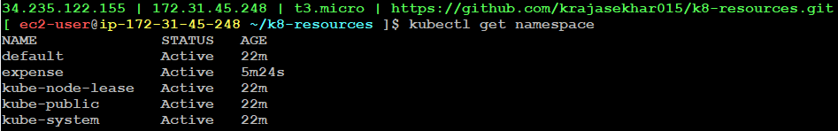

## Kubernetes Resources
- In kubernetes, everything is a resources

**1. Namespace**

- Just like VPC, you will have a dedicated isolated project to create your workloads/resources where we can create our workloads or resources.

Example:
```
apiVersion: v1
kind: Namespace
metadata: 
  name: expense
  labels:
    project: expense
    environment: dev
```

Command to Apply:
```
kubectl apply -f 01.namespace.yml
```
To get namespaces:
```
kubectl get namespaces
```


- Here, there will be one default namespace which is already created internally and there will be another three namespaces which are used for kubernetes internal purpose and another namespace `expense` which is created by us.

To delete namespaces:
```
kubectl delete -f 01.namespace.yml
```

**2. Pod**

- Pod is the smallest deployable unit in kubernetes. It can contain one or many containers

